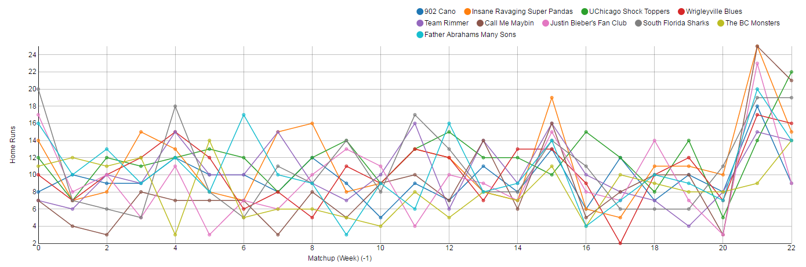
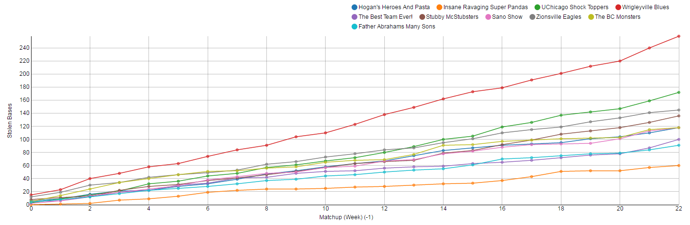

Summer is just about here and baseball is back in full swing (no pun intended). With summer nights under the bright lights and yet another year to be added to history there also comes a maniacal analysis and freakish infatuation with every baseball statistic that can possibly be tracked. Of course, this brings us to fantasy baseball.

In my ever-growing obsession with data and pretty graphs, I decided to look at the results from previous years of my fantasy baseball league. I’ve always played fantasy baseball with ESPN, and they closed all their APIs a bit ago, so I put together a little something to help me scrape the site for the data. I hope to refine that part and make it easy for anyone to copy. I will post something here when I get to that, but this post is about how I went from having the data in a JavaScript object to colorful charts.

The first thing I did was figure out what I wanted these graphs to look like. I wanted to compare the weekly progress of each team for each different category and I ended up with a simple multi-line graph. Eventually I found this [great example](http://bl.ocks.org/bobmonteverde/2070069) (thanks to [Bob Monteverde](https://github.com/bobmonteverde)). I then altered the D3 code a touch to create a reusable function that would fit my needs. I did this for both a week-by-week look as well as a cumulative view. I was quite pleased with the end result:

Note a spike in week 16 due the elongated “week” after the all-star break as well as the final two matchups that are each two weeks long for the playoffs.

There is certainly more that can be done to smooth out the UI. I would love to get to having a simple dropdown to choose the year and category accompanied by nice D3 transitions. There’s always more to do!

If you would like to see all the graphs you can view them [here](http://danhogan.github.io/fantasy-baseball-charts/)  and the code for all of this can be found [here](https://github.com/danhogan/fantasy-baseball-charts). Feel free to give me all the fantasy baseball advice you have!