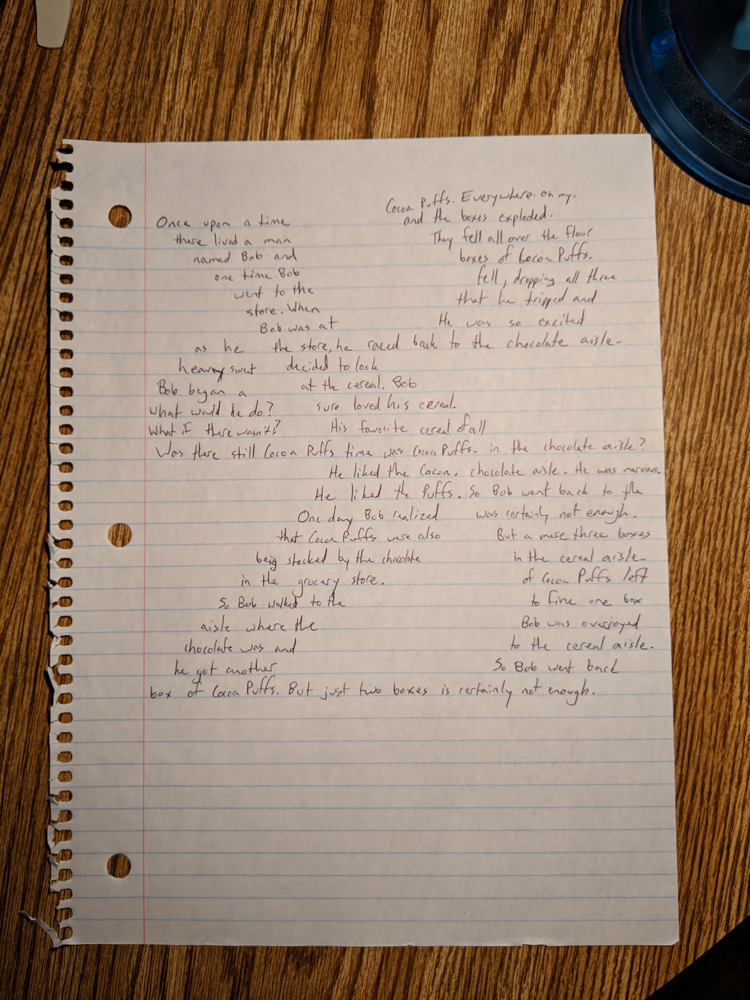

Once upon a time there lived a man named Bob and one time Bob went to the store. When Bob was at the store he decided to look at the cereal. Bob sure loved his cereal. His favorite cereal of all time was Cocoa Puffs.

He liked the Cocoa.

He liked the Puffs.

One day Bob realized that Cocoa Puffs were also being stocked by the chocolate in the grocery store. So Bob walked to the aisle where the chocolate was and he got another box of Cocoa Puffs.

But just two boxes is certainly not enough.

So Bob went back to the cereal aisle. Bob was overjoyed to find one box of Cocoa Puffs left in the cereal aisle.

But a mere three boxes was certainly not enough.

So Bob went back to the chocolate aisle.

He was nervous.

Was there still Cocoa Puffs in the chocolate aisle?

What if there wasn't? What would he do?

Bob began a heavy sweat as he raced back to the chocolate aisle. He was so excited that he tripped and fell, dropping all three boxes of Cocoa Puffs. They fell all over the floor and the boxes exploded.

Cocoa Puffs. Everywhere. Oh my.

This short story was brought to you by the still-in-school-and-using-paper version of me.

The answer is \"I don't know.\"