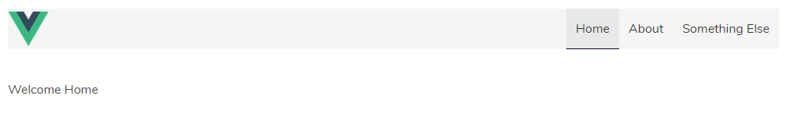
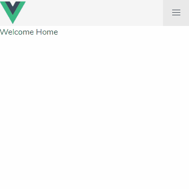

Lately I have been learning [Vue.js](https://vuejs.org/). In starting from a scratch Vue project, I weighed options of a CSS framework to use. I've used [Bootstrap](http://getbootstrap.com/) in the past, but I like how [Bulma](https://bulma.io/) can function without jQuery and that it is completely built on flexbox (plus it looked like a cool thing to learn).

 In creating a simple layout I started with a header and a few simple routes. Bulma has a cool [navbar](https://bulma.io/documentation/components/navbar/) component that makes it easy to get things going.
 
 
 
 The navbar component is of course responsive out of the box, but with Bulma being CSS-only, there is not a way to open the menu in a small/mobile view.
 
 I went searching for a solution that worked with Vue, but it took a bit of searching and a little while to put the pieces together. In [the spirit of Chris Coyier](https://twitter.com/chriscoyier/status/925081793576837120?lang=en), I decided to create this post here. Hopefully your skimming ability was able to ignore all of this fluff and get right to the solution below.
 
 The trick is creating a simple variable in Vue that defaults to false and can change on click.
 
 ```javascript
export default {
    data: function() {
        return {
            isOpen: false
        }
    }
}
 ```

 Now we can use Vue's v-bind to flip the appropriate Bulma class on and off. Here's the whole template: 
 
 ```html
<nav class="navbar is-light" role="navigation" aria-label="main navigation">
    <div class="navbar-brand">
        
        <a role="button" class="navbar-burger" aria-label="menu" aria-expanded="false" @click="isOpen = !isOpen" v-bind:class="{'is-active': isOpen}">
            <span aria-hidden="true"></span>
            <span aria-hidden="true"></span>
            <span aria-hidden="true"></span>
        </a>
    </div>
    <div class="navbar-menu" v-bind:class="{'is-active': isOpen}">
        <div class="navbar-end">
            <router-link to="/" class="navbar-item is-tab">Home</router-link>
            <router-link to="/about" class="navbar-item is-tab">About</router-link>
            <router-link to="/else" class="navbar-item is-tab">Something Else</router-link>
        </div>
    </div>
</nav>
 ```
 
 And there you have it! When the burger icon is clicked, the `isOpen` variable simply gets changed to the opposite boolean value and the `is-active` Bulma class is toggled.

 