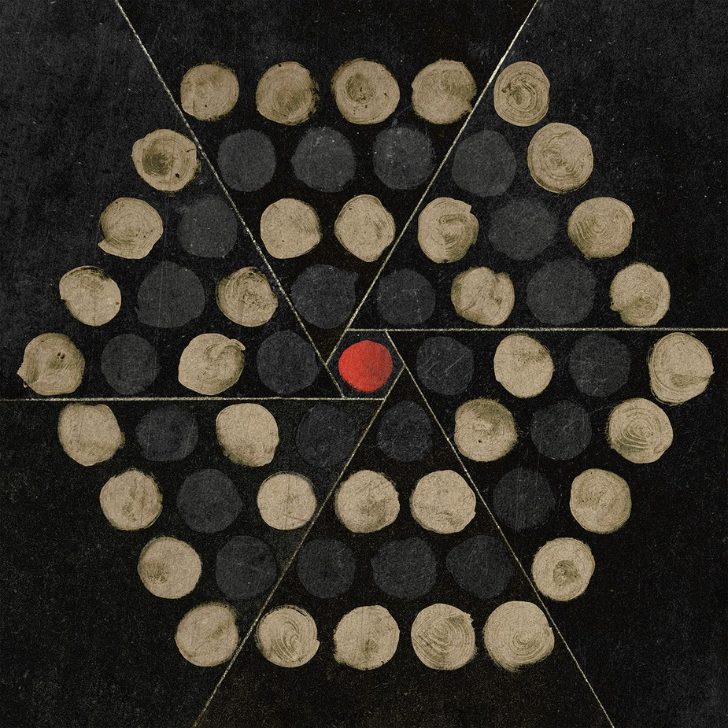
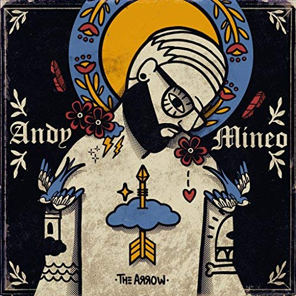
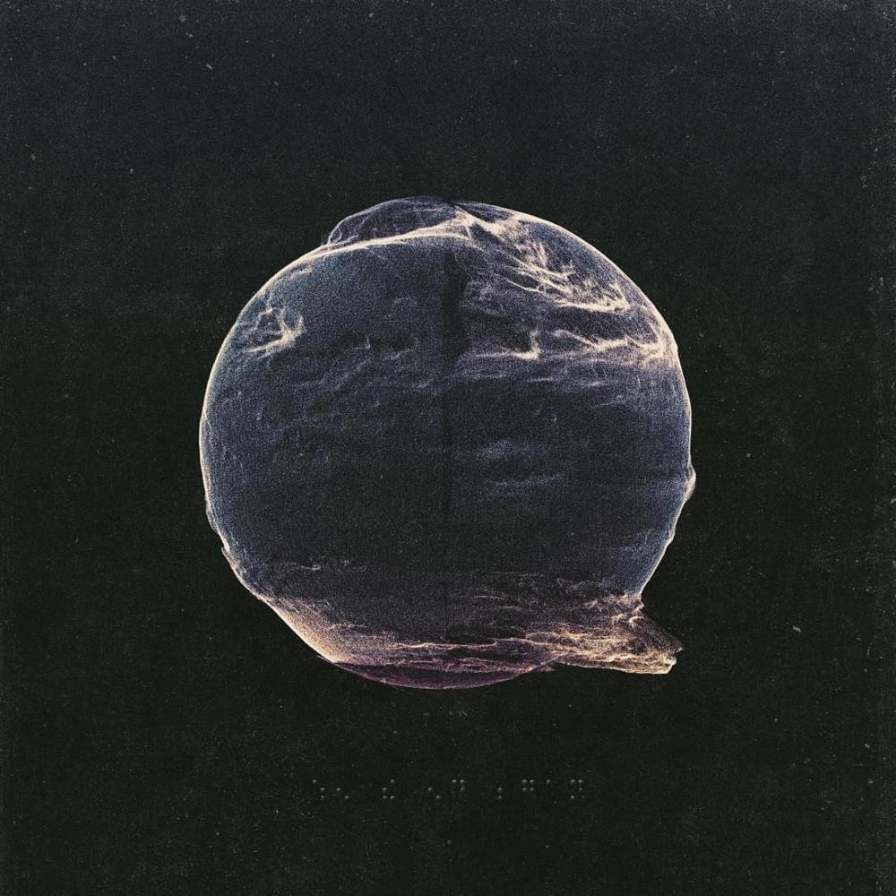
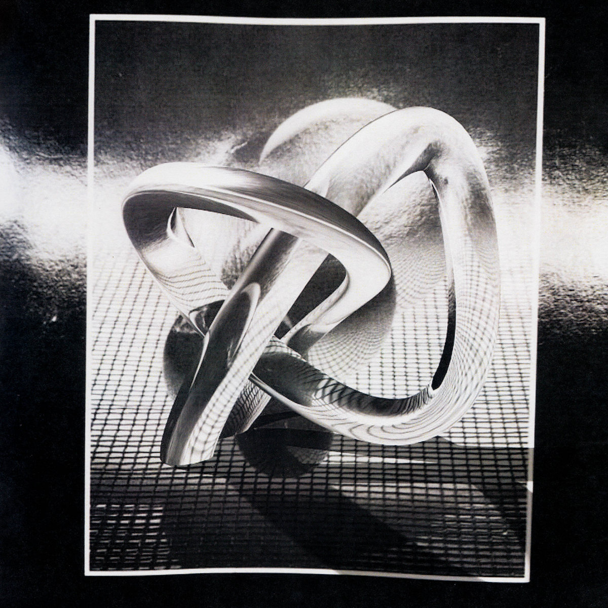
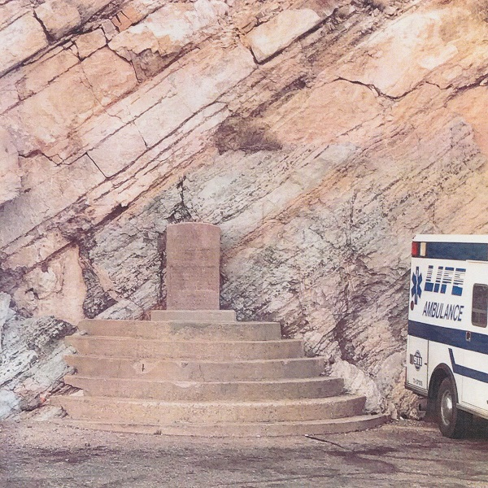

# check and compare all of this to live site

## 1. Palms - Thrice

I've been a big fan of Thrice for somewhere close to fifteen years. Any time they put an album out, it's probably going to be the album of the year for me. Palms is no exception. Thrice got a touch more experimental than their 2016 comeback release, [To Be Everywhere Is To Be Nowhere](https://www.youtube.com/watch?v=XRv-Eio7WZM) and, if you like music, it pays off. Thrice has always evolved their sound from record to record, but it's always had a \"Thricey-sound\" too. I love the whole album, but some of my favorite tracks are Just Breathe, *Blood On Blood*, and *Beyond The Pines*. Beyond The Pines will be Thrice's closer for years to come and it will be great every time.

<iframe src="https://www.youtube.com/embed/cHjmb6-3Cqo" frameborder="0" allow="accelerometer; autoplay; encrypted-media; gyroscope; picture-in-picture" allowfullscreen></iframe>

## 2. I: The Arrow - Andy Mineo

I don't listen to rap all that much, but Andy Mineo has been putting out music for years now that always catches my ear. His lyrics are raw and real in a way unlike most any other rapper out there. Two of my favorite tracks off this EP are Clarity and I Ain't Done.

<iframe src="https://www.youtube.com/embed/Ki2c9GnL8L8" frameborder="0" allow="accelerometer; autoplay; encrypted-media; gyroscope; picture-in-picture" allowfullscreen></iframe>

 Bonus from the Reach Records family:

 

 <iframe src="https://www.youtube.com/embed/rUsaOOKIZjw" frameborder="0" allow="accelerometer; autoplay; encrypted-media; gyroscope; picture-in-picture" allowfullscreen></iframe>
 

 
 ## 3. When The End Began - Silent Planet
 
 
 In a slightly different sonic direction from Andy Mineo, there's Silent Planet. The lead vocalist of Silent Planet, Garrett Russell (king of double letters), is writing lyrics on another level. He must sleep with his head on a dictionary. The lyrics might seem complex due to the expanded vocab, but they're constructed in a poetic style that fits the vocal style too. Each song tells a story with intense emotion. Russell is very open about his intentions for each song and has various [videos out there](https://www.youtube.com/watch?v=iCer4gJhFDg) explaining each track. Some of my favorite tracks off this album are *In Absence*, *Firstborn (Ya'aburnee)*, and *Depths III*.

 

 <iframe src="https://www.youtube.com/embed/kZk9HCYDawM" frameborder="0" allow="accelerometer; autoplay; encrypted-media; gyroscope; picture-in-picture" allowfullscreen></iframe>
 

 
 ## 4. New Others - This Will Destroy You
 

 
 This is actually two albums released in consecutive months. To be honest, these were released later in the year and I haven't listened to it as much as the others, but This Will Destory You always puts out some of my favorite tunes in the post-rock world.

 

 <iframe src="https://www.youtube.com/embed/kd1dhaUxDj0" frameborder="0" allow="accelerometer; autoplay; encrypted-media; gyroscope; picture-in-picture" allowfullscreen></iframe>
 

 
 ## Bonus!
 Below are some of my most listened to tracks of 2018
 
 ### Sour Breath - The Devil Wears Prada
 This tune is a cover of a song by Julien Baker. It's good.

 

 <iframe src="https://www.youtube.com/embed/PbgCUcuPpjs" frameborder="0" allow="accelerometer; autoplay; encrypted-media; gyroscope; picture-in-picture" allowfullscreen></iframe>
 

 
 ### Polyphia | G.O.A.T.
 These dudes shred and are making some of the tightest instrumental rock out there.

 

 <iframe src="https://www.youtube.com/embed/9_gkpYORQLU" frameborder="0" allow="accelerometer; autoplay; encrypted-media; gyroscope; picture-in-picture" allowfullscreen></iframe>
 

 
 ## Bonus 2017 Leftovers
 Maybe my two most listened to non-Thrice tracks of 2018 came from 2017.
 
 ### Silver Tongues - I The Mighty
 It has that mid-2000s energy that old me craves.

 

 <iframe src="https://www.youtube.com/embed/wnfEONkyopA" frameborder="0" allow="accelerometer; autoplay; encrypted-media; gyroscope; picture-in-picture" allowfullscreen></iframe>
 

 
 ### Return to the Earth - The Contorionist

 

 <iframe src="https://www.youtube.com/embed/yAfAxmhWmcQ" frameborder="0" allow="accelerometer; autoplay; encrypted-media; gyroscope; picture-in-picture" allowfullscreen></iframe>
 

 
## Spotify Playlist
If you're into dat Spotify life, [here's a playlist](https://open.spotify.com/playlist/3LIcnJ7Z0tOHAIUABEhlUQ) of the tunes listed above.

