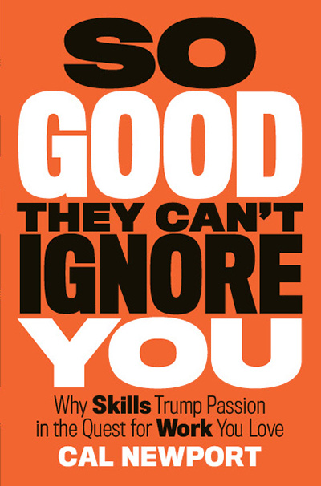
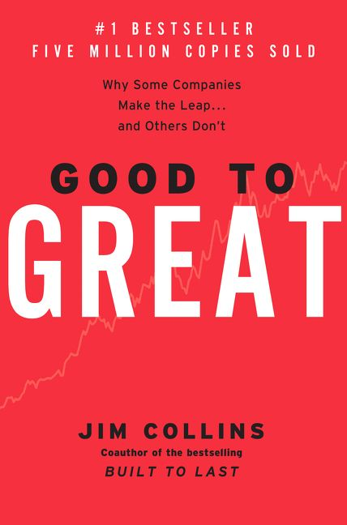
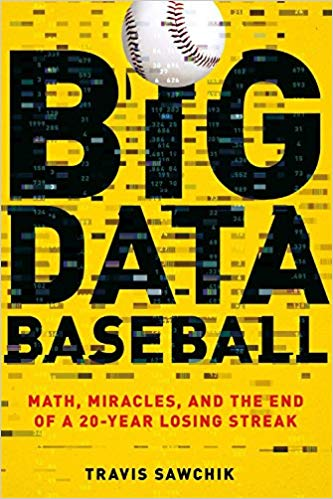

## So Good They Can't Ignore You by Cal Newport

It had been an embarrasingly long time since I picked up a physical book and read it all the way through. So Good They Can't Ignore You is a thought-provoking read that helped me remember why I might've ever liked reading. This book helped to organize some things in my mind and gave a little extra kick of motivation. I would recommend this book to anyone trying to coordinate their many interests and pursuits.

I'll give it a 4 out of 5

## Good To Great by James Collins

Good To Great has held some odd position in my mind as some sort of classic for any business-minded person. Perhaps it is. The book was originally published in 2001 after an incredible amount of research. Some of the book can already appear dated at times, but the heart of it is absolutely still relevant. I would definitely recommend this to anyone in a leadership position or anyone simply looking to push things forward - in business or life in general. I particularly enjoy this quote:

> Leading from good to great does not mean coming up with the answers and then motivating everyone to follow your messianic vision. It means having the humility to grasp the fact that you do not yet understand enough to have the answers and then to ask the questions that will lead to the best possible insights. (page 75)

Seems like a pretty good life lesson to me.

I'll give it a 4 out of 5

## Big Data Baseball by Travis Sawchik

*Big Data Baseball* was an enjoyable read from Travis Sawchik, who I was already familiar with seeing on [fangraphs.com](https://www.fangraphs.com/). The book gives incredible insight into a struggling Pirates franchise and how they leveraged their brains to improve their on-field play. The whole thing reads like a delightful story and I would definitely recommend it to any baseball fan.

I'll give it a 4 out of 5

