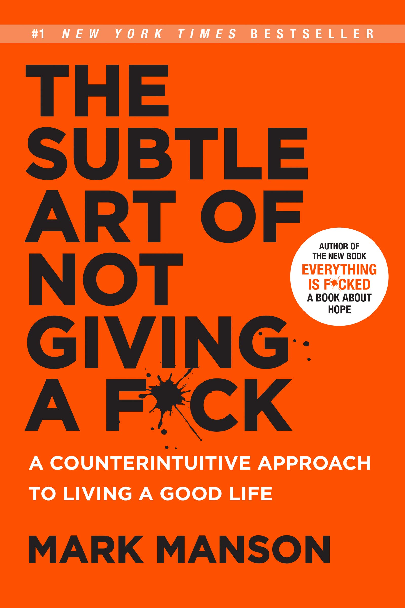
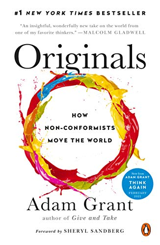

## The Subtle Art of Not Giving a F*ck by Mark Manson

### A Counterintuitive Approach to Living a Good Life
This was my first time trying an audiobook. A temporarily randomly-long commute enabled a strong podcast game in 2020 and I snuck in two audiobooks. Overall, I definitely get through books faster when there is a consistent tempo, but I would question if the comprehension/retention loss is worth it.

This book itself contained several simple truths that are good reminders. Sometimes we need another reminder or a memorable story to help things stick and this book helps accomplish that. It was a fine book I guess, but it was difficult for me to ever take it all too seriously given the title.

2 of 5

## Originals by Adam Grant

### How Non-Conformists Move the World
My second audiobook experience, *Originals* also contained a handful of solid thought. It's rather similar in that the stories can help things stick. 'Twas fine.

3 of 5

