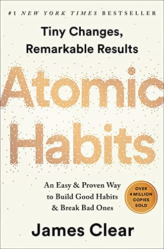
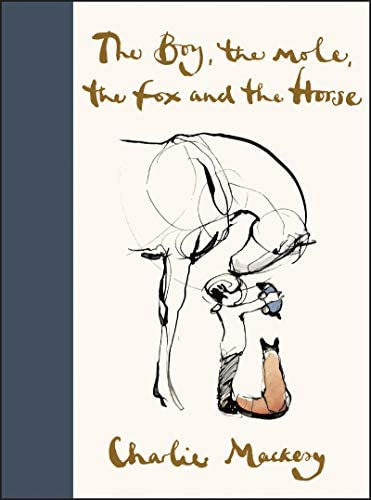

## Atomic Habits by James Clear

### An Easy & Proven Way to Build Good Habits & Break Bad Ones
I read this earlier in the year and I read it in a funky digital format, so I don't have the page numbers, but here are some quotes I liked enough to copy down:

> Ultimately, it is your commitment to the *process* that will determine your *progress*.

> You do not rise to the level of your goals. You fall to the level of your systems.

> Habits reduce cognitive load and free up mental capacity, so you can allocate your attention to other tasks.

> If motion doesn't lead to results, why do we do it? Sometimes we do it because we actually need to plan or learn more. But more often than not, we do it because motion allows us to feel like we're making progress without running the risk of failure... ...And that's the biggest reason why you slip into motion rather than taking action: you want to delay failure.

> Furthermore, habit tracking provides visual proof that you are casting votes for the type of person you wish to become, which is a delightful form of immediate and intrinsic gratification.

> Professionals stick to the schedule; amateurs let life get in the way.

I greatly enjoyed the pragmatic approaches and would suggest the book to anyone.

5 of 5

## The Boy, the Mole, the Fox and the Horse by Charlie Mackesy

I don't remember where I saw this book suggested. I just remember liking the vibe.

4 of 5

